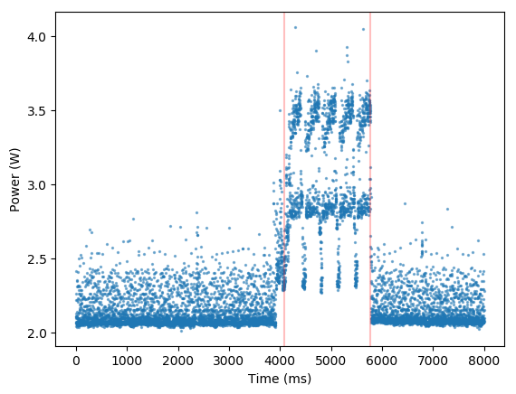

# Benchmark-tfl

## Prepare

### Compile

```sh
cd $BENCHMARKK_ROOT_DIR
mkdir build
cd build
cmake .. -DCMAKE_BUILD_TYPE=Release \
         -DTENSORFLOW_LITE_SOURCE_DIR=$TENSORFLOW_ROOT_DIR/tensorflow/contrib/lite \
         -DCMAKE_TOOLCHAIN_FILE=../toolchains/tizen.cmake \
         -DTIZEN_DEVICE=ON \
         -DTIZEN_TARGET=mobile-4.0
make -j8
```

Additionally, you can set the following argument with cmake:

```sh
-DTIZEN_SDK=$HOME/tizen-studio
```

You should see `beeswax` and `bumblebee` ARM executables inside the build directory.   

### Test data

These files are inside the `testdata` folder.
- `./mobilenet_quant_v1_224.tflite`
    - a tensorflow flatbuffer model
- `./labels.txt`.
    - a text file with the labels of your model
- `./image_list.txt`.
    - a text file listing the example images
- `./dingo.bmp`, `./grace_hopper.bmp`, `./llama.bmp`, `./scabbard.bmp`, `./tench.bmp`
    - image examples

### Send to raspberry pi

```sh
# Pull back the executable and testdata from hive
rsync -zah hive:benchmark_tfl/build/beeswax .
rsync -zah hive:benchmark_tfl/build/bumblebee .
rsync -zah hive:benchmark_tfl/testdata .

# Connect to raspberry pi
create_tunnel rpi
sdb connect localhost:10101 && sdb root on

# Send executables
sdb push beeswax beeswax
sdb push bumblebee bumblebee

# Send testdata
sdb push testdata/mobilenet_quant_v1_224.tflite mobilenet_quant_v1_224.tflite
sdb push testdata/labels.txt labels.txt
sdb push testdata/image_list.txt image_list.txt
sdb push testdata/dingo.bmp dingo.bmp
sdb push testdata/grace_hopper.bmp grace_hopper.bmp
sdb push testdata/llama.bmp llama.bmp
sdb push testdata/scabbard.bmp scabbard.bmp
sdb push testdata/tench.bmp tench.bmp

```

## Beeswax
By LEDL inspired by TensorFlow Lite's label_image.    
Loads a flatbuffer model and its labels and run inference with images.

To display the help message and check the supported arguments, issue:

```
./beeswax -h
```

### Usage

```sh
# Enter raspberry pi shell
sdb shell

# Run inference of one image with the model 'mobilenet_v1_1.0_224.tflite' and its label file 
./beeswax -i grace_hopper.bmp -m mobilenet_v1_1.0_224.tflite -l labels.txt

# Run 10 inferences of one image with the model 'mobilenet_v1_1.0_224.tflite' and its label file 
./beeswax -i grace_hopper.bmp -m mobilenet_v1_1.0_224.tflite -l labels.txt -c 10

# Run one inference of all images in image_list with the model 'mobilenet_v1_1.0_224.tflite' and its label file 
./beeswax -f image_list.txt -m mobilenet_v1_1.0_224.tflite -l labels.txt
```

Output of one image:

```sh
image-path: grace_hopper.bmp
loops: 1
top-5: military uniform (42.75%) | Windsor tie (30.59%) | mortarboard (4.31%) | bow tie (3.14%) | drumstick (2.35%)
time: 303.649 ms 
start-end: 1469805242.315 1469805242.619
```

## Bumblebee

Reads energy information from SmartPower2 and prints the energy readings in an infinite loop.    
Prints two lines at a time:
- A clock timestamp (seconds since epoch)
- Energy readings (amperes) starting on that timestamp separated by 1ms.

### Usage

```sh
# Enter raspberry pi shell
# It needs to be connected to smartpower2
sdb shell

./bumblebee
```

Output example:
```sh
CLOCK: 1534966710.471 s
0.476,0.446,0.439,0.461,0.549,0.547,0.501,0.529,...
CLOCK: 1534966711.469 s
0.480,0.415,0.456,0.416,0.430,0.413,0.415,0.426,...
```

## Graph example

5 inferences, red bars indicate start and end of inferences. 
`bumblebee` colected the energy spent and `beeswax` executed the inferences:    

